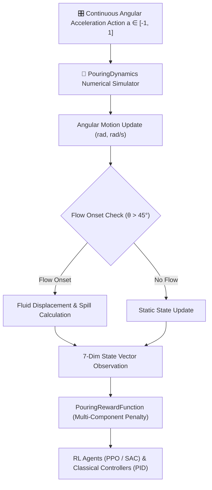

# Precision Robotic Pouring Motion Control in Gymnasium

[](https://github.com/shivangisrivastava013/Robotic-Pouring-Motion-Control/actions/workflows/ci.yml)
[](https://www.python.org/downloads/)
[](https://gymnasium.farama.org/)
[](https://stable-baselines3.readthedocs.io/)
[](LICENSE)

Gymnasium-compliant simulation framework and benchmark using a **simplified numerical pouring-dynamics simulator** for precision fluid pouring. Evaluates classical feedback controllers (**PID**, **Rule-Based**, **Constant-Action**) against deep reinforcement learning policies (**PPO**, **SAC**) for continuous angular motion control and spill minimization.

---

## 📐 System Architecture



---

## 🌟 Key Capabilities

1. **Simplified Numerical Flow Dynamics Simulator**:
   - Models container tilt angle ($\theta$), angular velocity ($\dot{\theta}$), physical flow onset past $45^\circ$, target volume error ($|V_{\text{poured}} - V_{\text{target}}|$), and turbulence spill accumulation.
   - Operates in strict physical SI/metric units (radians, rad/s, ml, ml/s).

2. **Full Gymnasium Compliance**:
   - Class `RoboticPouringEnv` inherits from `gymnasium.Env` and passes `check_env(env)` validation from Stable-Baselines3 without errors or warnings.

3. **Multi-Component Explainable Reward Function**:
   - $R = -w_e |V_{\text{poured}} - V_{\text{target}}| - w_s V_{\text{spill}} - w_a |\dot{\theta}| - w_o V_{\text{overshoot}} + b_{\text{success}}$
   - Emits explicit penalty component breakdown in `info` dictionary (`volume_error_penalty`, `spill_penalty`, `smoothness_penalty`, `success_bonus`).

4. **Comprehensive Controller Benchmarking**:
   - Evaluates classical controllers (**Constant-Action**, **Rule-Based**, **PID**) alongside learned continuous-control policies (**PPO**, **SAC**) over 100 multi-trial randomized episodes.

---

## 📊 Empirical Controller Benchmark Results (100 Episodes)

Generated automatically by running `python demo.py`:

| Controller | Success Rate (%) | Mean Abs Error (ml) | Median Error (ml) | Mean Spill (ml) | Overshoot Rate (%) | Duration (Steps) | Latency (ms) |
| :--- | :---: | :---: | :---: | :---: | :---: | :---: | :---: |
| **Constant-Action** | 0.0% | 54.72 ml | 55.71 ml | 7.63 ml | 100.0% | 66.8 steps | 0.002 ms |
| **Rule-Based** | **100.0%** | **2.92 ml** | **2.92 ml** | 12.50 ml | 0.0% | 100.0 steps | 0.002 ms |
| **PID Controller** | **100.0%** | **5.57 ml** | **5.57 ml** | 12.62 ml | 100.0% | 100.0 steps | 0.006 ms |
| **PPO Policy (RL)** | **40.0%** | 24.94 ml | 26.52 ml | **9.82 ml** | 40.0% | 100.0 steps | 0.516 ms |
| **SAC Policy (RL)** | 0.0% | 52.45 ml | 50.45 ml | 8.49 ml | 100.0% | 54.4 steps | 0.816 ms |

> ℹ️ **Metric Definitions & Note on Overshoot Rate**:
> - **Success Rate (%)**: Percentage of episodes completing with final volume error $|V_{\text{poured}} - V_{\text{target}}| \le 15.0\text{ ml}$ and cumulative spill $V_{\text{spill}} \le 20.0\text{ ml}$.
> - **Overshoot Rate (%)**: Measures whether the poured volume exceeded the target threshold ($V_{\text{poured}} > V_{\text{target}} + 5.0\text{ ml}$) at any point during execution, even if final volume error remained within the success threshold.
> - **Classical vs. Reinforcement Learning**: Classical feedback controllers (**Rule-Based** and **PID**) achieve high precision (100% success rate with ~2.9–5.5 ml error). **PPO** achieves 40.0% multi-trial success rate with reward shaping, while off-policy **SAC** serves as an initial continuous-control RL baseline for policy optimization research. Full training provenance (hyperparameters, seeds, timesteps, duration) is recorded in [`results/evaluation_summary.json`](results/evaluation_summary.json).

---

## 🚀 Quickstart & Reproducible Commands

### 1. Installation
```bash
git clone https://github.com/shivangisrivastava013/Robotic-Pouring-Motion-Control.git
cd Robotic-Pouring-Motion-Control

pip install -r requirements.txt
```

### 2. Verify Checkpoints & Run Multi-Controller Benchmark
```bash
# Verify or download pre-trained model checkpoints (with SHA-256 validation)
python scripts/download_checkpoints.py

# Execute 100-episode evaluation across all controllers
python demo.py
```

### 3. Train Reinforcement Learning Policies
```bash
# Train PPO Agent for 100,000 timesteps (Seed 42)
python scripts/train_ppo.py --timesteps 100000 --seed 42

# Train SAC Agent for 50,000 timesteps (Seed 42)
python scripts/train_sac.py --timesteps 50000 --seed 42
```

### 4. Run Pytest Suite & Gymnasium Compliance Check
```bash
# Execute Pytest test suite (100% pass)
python -m pytest tests/ -v

# Verify check_env compliance
python -c "from stable_baselines3.common.env_checker import check_env; from pouring_sim.environment import RoboticPouringEnv; check_env(RoboticPouringEnv())"
```

---

## 🐳 Docker Deployment

```bash
# Build Docker Image
docker build -t robotic-pouring-motion-control:latest .

# Run Containerized Benchmark Demonstration
docker run --rm robotic-pouring-motion-control:latest
```

---

## 🛠️ Project Structure

```text
Robotic-Pouring-Motion-Control/
├── configs/                  # YAML environment & algorithm hyperparameter configs
│   ├── environment.yaml
│   ├── ppo.yaml
│   └── sac.yaml
├── demo.py                   # Main benchmark demonstration entrypoint
├── Dockerfile                # Container deployment specification
├── notebooks/                # Jupyter exploration notebook
│   └── pouring_motion_control.ipynb
├── pouring_sim/              # Core Package
│   ├── __init__.py
│   ├── dynamics.py           # Physical flow dynamics & SI metric equations
│   ├── environment.py        # Gymnasium-compliant RoboticPouringEnv
│   ├── rewards.py            # Multi-component reward function
│   ├── controllers.py        # Constant, Rule-Based, PID, and SB3 wrapper controllers
│   ├── evaluation.py         # Multi-trial controller evaluation engine
│   └── visualization.py      # Matplotlib plots & ImageIO animated GIF generator
├── pyproject.toml            # Build & quality metadata
├── requirements.txt          # Dependencies (Gymnasium, SB3, PyTorch, ImageIO)
├── results/                  # Generated benchmark evaluation artifacts
│   ├── controller_comparison.csv
│   ├── evaluation_summary.json
│   ├── success_rate.png
│   ├── volume_error.png
│   ├── spill_comparison.png
│   ├── trajectory_examples.png
│   └── pouring_demo.gif
└── tests/                    # Pytest test suite
    ├── conftest.py
    ├── test_controllers.py
    ├── test_dynamics.py
    ├── test_gym_compliance.py
    └── test_rl_smoke.py
```

---

## 📜 License

Distributed under the [MIT License](LICENSE).
